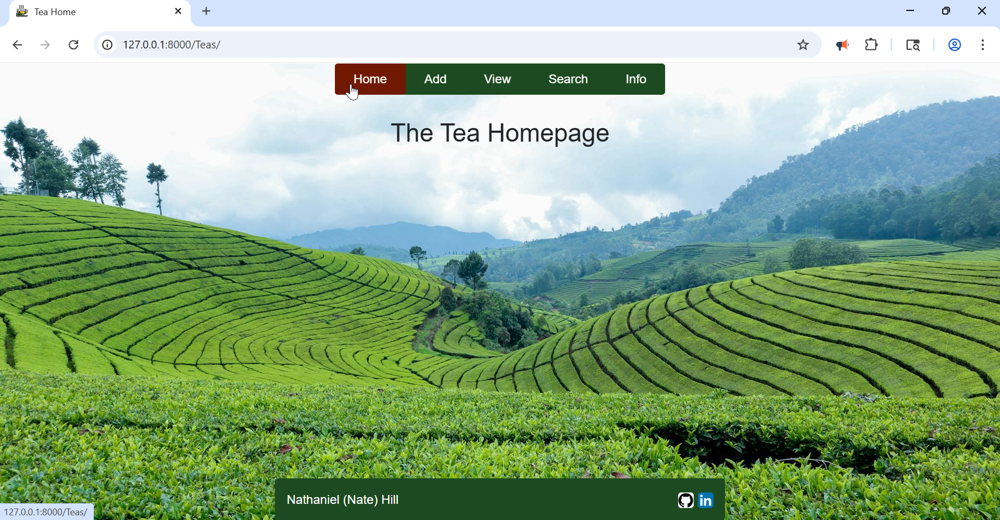

# Python Live Project (The Tech Academy)

## Project Overview
__Role__: Full-Stack Developer
__Tech Stack__: Django, Python, JavaScript, HTML/CSS, Bootstrap, Crispy Forms, BeautifulSoup, Regex, TextBlob

The Teas App is a desktop web application that assists users in documenting, listing, managing, and rating their own collection of different types of teas. Primarily accomplished through a solid foundation in CRUD functionality, the app allows users to manage database operations (add, edit, view, sort, delete) through the webapp interface. Additionally, it allows users to search through both web-scraped site data and API returned data (in several different views) and preloads selected rows' data onto the create page to ease in record creation. 

Project management principles were applied throughout the Live Project using Agile Methodolgies' Scrum framework; we had sprint planning and spring retrospective meetings, daily stand-ups, documented progress through user stories, and all work was accomplished within one sprint. Each team memeber was responsible for crafting their app, tracking their branches through version control (commiting, pushing, creating pull requests) and updating tickets within the Azure DevOps platform. 

## Core Technologies
- __Backend__: Django, Python
- __Frontend__: HTML, CSS, Bootstrap, JavaScript
- __Database__: SQLite (via Django ORM)
- __APIs__: Fake Tea API (display data)
- __Libraries__: 
    - BeautifulSoup (web scraping) 
    - TextBlob (part-of-speech tagging) 
    - Regex (search pattern) 
    - JSON (structure, transmit)
- __Version Control & Project Management__: Git, Azure DevOps

## Key Features
- Data Sorting: Users can quickly organize their tea records by any field (name, type, origin, source, oxidation level, steep amount, flavor profile, rating, etc.); selecting the column header once returns all items in ascending or alphabetical order, selecting the same header again updates the order to descending. 

- API & Web-Scraping Integration: BeautifulSoup was used to scrape third-party webpage data and display it in the app's Site section. A RESTful API was similarly used to pull and display third-party API data in the Search page.

- "Multiple Views" Feature: Both API data and Web-Scraped data show on their respective pages in selectable formats allowing users to customize their view. The API Search page shows a filtered list of desired dictionary items as both formatted JSON code and rows in table format. A bulleted list of site-scraped data and that same data formatted into table format displays for the Web-Scraper. 

- Tea Search: Users can search through both lists of teas using keywords to be found throughout all text. If matches are found, that row displays; if not, the row is hidden. 

- Field Auto-Preloading: On the web-scraped site page, users can select the names of any tea and that tea data will automatically load into the associated fields of the Create page, which the user is redirected to. 

## User Stories
1. [Basic App Structure & Front-End Work](#Basic-App-Structure-&-Front-End-Work)
1. [Model Creation](#Model-Creation)
1. [Display All Items](#Display-All-Items)
1. [Details, Edit, And Delete Functions](#Details,-Edit,-And-Delete-Functions)
1. [API (Connect & Parse)](#API-(Connect-&-Parse))
1. [BeautifulSoup](#BeautifulSoup)
1. [Front-End Improvements](#Front-End-Improvements)
1. [Save Scraped Results](#Save-Scraped-Results)
1. [TextBlob & BugFix](#TextBlob-&-BugFix)

### Basic App Structure & Front-End Work
The first step was to create a new app within the Django project, and get it to display a homepage with basic content. After registering the new app in Django's settings.py, I created a base HTML file (that all other pages would inherit styling from) and an HTML file for the homepage. I registered the url in urls.py, created a basic function to display the homepage in views.py, and added significant responsive styling to ensure a clean and consistent look in navbar items, footer, background and title. Resting and hover state colors were based around the theme of "tea" and image-links were added to the footer to link to my GitHub, LinkedIn, and my personal email. 



### Model Creation
Next, I was tasked with creating a database model for teas and adding the ability to create new (database records for) teas. Django's ORM (in models.py) was used to define the model and migrations were made to generate (and update) the database table. I chose to use subclasses to list IntegerChoice options for organizaiton and general readability.

```python
class Teas(models.Model):
    name = models.CharField(max_length=20, unique=True)
    class TeaType(models.IntegerChoices): #Subclass to give choice options
        BLACK = 0, "Black Tea"
        GREEN = 1, "Green Tea"
        WHITE = 2, "White Tea"
        OOLONG = 3, "Oolong Tea"
        HERBAL = 4, "Herbal Tea"
    type = models.IntegerField(choices=TeaType.choices) #Choosing those options in a select-one dropdown (by default)
    source = models.CharField(max_length=40, blank=True, null=True)
    origin_locale = models.CharField(max_length=20, blank=True, null=True)
    class OxidationLevel(models.IntegerChoices): #Subclass to give choice options
        UNOXIDIZED = 0, "Unoxidized"
        MINIMALLY = 1, "Minimally"
        PARTIALLY = 2, "Partially"
        FULLY = 3, "Fully"
    oxidation = models.IntegerField(choices=OxidationLevel.choices, default=OxidationLevel.UNOXIDIZED) #Choosing those options
    description = models.TextField(max_length=400, blank=True, null=True)
    steep_amount = models.FloatField(default=4, help_text='minutes')
    flavor_profile = models.CharField(max_length=60)
    has_caffeine = models.BooleanField(default=False) #Shows in a checkbox by default
    caffeine_amount = models.DecimalField(max_digits=5, decimal_places=2, blank=True, null=True, help_text='mg')
    class Rating(models.IntegerChoices): #Subclass to give choice options
        VERY_BAD = 1, "Very Bad"
        BAD = 2, "Bad"
        OKAY = 3, "Okay"
        GOOD = 4, "Good"
        GREAT = 5, "Great"
    rating = models.IntegerField(choices=Rating.choices) #Choosing those options in a select-one dropdown (by default)

    tea = models.Manager()
```

I then set out to build a form that would reflect all database elements as input fields and a templage page to display them. After struggling with layouts not aligning with my desires, I opted to use Django's Crispy Forms which simplified rendering and also allowed the application of Bootstrap directly, which enhanced the form's aesthetic. Eager to include widgets, I added one that turns a dropdown into Radio Buttons and another to adjust the sizing of my description field for both function and overall look. 

```python
#Combines the built-in ModelForm structure with the full Teas database table
class TeasForm(forms.ModelForm):
    class Meta:
        model = Teas
        fields = '__all__'
        widgets = {
            'oxidation': forms.RadioSelect, #Makes the Oxidation input use Radio buttons
            'description': forms.Textarea(attrs={
                'cols':95, 'rows':5, #Sets a custom width/height to fit the page better
                'style': 'width: auto;'
            }),
        }

    #Uses crispy forms to adjust the layout of the presented data fields for the Create page
    def __init__(self, *args, **kwargs):
        super().__init__(*args, **kwargs)
        self.helper = FormHelper() #Allows control over a form layout, attributes, and rendering behavior
        self.helper.help_text_inline = True #Allows help_text to show to the right of the text field
        self.helper.layout = Layout( #Defines the structure, order, and styling of form fields
            Div( #Gives three columns of form fields that are smallish sized in a row format (styled with Bootstrap)
                Div('name', 'type', 'oxidation', css_class='col-md-4'),
                Div('steep_amount', 'has_caffeine', 'caffeine_amount', 'rating', css_class='col-md-4'),
                Div('source', 'origin_locale', 'flavor_profile', css_class='col-md-4'),
                Div('description'),
                css_class='row'
                ),
        )
```

After applying some Bootstrap to the Create page template and writing a views.py function to render the form on said page, I added a Submit button and tested until Tea records could be added to the database through the new Create page. 

### Display All Items
The next request was to create a page that would display all data within the database records; the "View" template was created to accomplish this. To maintain a consistent look and to follow DRY (Don't Repeat Yourself) principles, most styling was carried over from the create page with a few alterations: table format was chosen to display the data with headers, width was expanded to avoid rendering issues, and bootstrap styling was added to the table. A view was written to pass all database items to the template, which dynamically displayed all data. 


An optional addition I was particularly happy with was the sort feature. I turned table headers into links that, when clicked, would organize all data into ascending or alphabetical order. Re-clicking that header would reverses the order to descending. I used the `order_by` method for Django QuerySets, url manipulation, and Django template logic to accomplish this functionality. 

```html
<table class="table table-bordered table-striped"> <!--Adds table styling (borders, striped offset background colors, appropriate spacing)-->
            <thead class="table-primary text-center"> <!--Adds background color for the section header and centers its text-->
                <tr> <!--Each table header will sort by id (by default), and then switch between ascending and descending upon further clicks-->
                    <th><a href="?sort=-name">Name</a></th>
                    <th><a href="?sort=-type">Type</a></th>
                    <th><a href="?sort=-source">Source</a></th>
                    <th><a href="?sort=-origin_locale">Origin</a></th>
                    <th><a href="?sort=-oxidation">Oxidation</a></th>
                    <th><a href="?sort=-steep_amount">Steep Time</a></th>
                    <th><a href="?sort=-flavor_profile">Flavors</a></th>
                    <th><a href="?sort=-has_caffeine">Has Caffeine?</a></th>
                    <th><a href="?sort=-caffeine_amount">Amount (mg)</a></th>
                    <th><a href="?sort=-rating">Rating</a></th>
                    <th><a href="?sort=-description">Description</a></th>
                </tr>
            </thead>
            <tbody> <!--Loads all dB data in a table format-->
                
                <tr>
                    <td><a href="">{{ tea.name }}</a></td> <!--Links to details page upon click-->
                    <td>{{ tea.get_type_display }}</td>
                    <td>{{ tea.source }}</td>
                    <td>{{ tea.origin_locale }}</td>
                    <td>{{ tea.get_oxidation_display }}</td>
                    <td>{{ tea.steep_amount }}</td>
                    <td>{{ tea.flavor_profile }}</td>
                    <td>{{ tea.has_caffeine|default:"No" }}</td>
                    <td>{{ tea.caffeine_amount|default:"0" }}</td>
                    <td>{{ tea.rating }}</td>
                    <td>{{ tea.description }}</td>
                </tr>
                
            </tbody>
        </table>
```

### Details, Edit, And Delete Functions
The next task was to build a Detais page that would display all data for a single selected database record. It felt only natural to link to this new page from the Views page, as it was showing all database records already. After adding to the urls and views.py files, I added a template that extended nearly all of its design from the Create page, and made a link on the View page table rows that would pull the select rows' primary key (unique identifier) to the new Details page. As this new Details page closely resembled the Create page, I differentiated it by emcopassing the table in a fieldset element set with an `inert` attribute, which showed record data in a read-only state (the button was also unique in location and text).  

I used this Details page to leapfrog right into the next request, enabling edit and delete funcionality on a separate page. Following similar steps as above (with notable differences in the views.py), the Details page button now links to the Edit/Delete page. 

```python
def tea_edit(request, pk): #Defines the function and the parameters used (request is part of the HTTPrequest)
    pk = int(pk) #Setting the pk variable to an integer value of the primary key, captured from the URL
    item = get_object_or_404(Teas, pk=pk) #Setting the item variable to the value of the dB's Teas model using the particular record taken from the URL before, if errors, show a 404
    form = TeasForm(data=request.POST or None, instance=item) #Setting the form variable to be the TeasForm using POST data (or none at all) pre-filled with the specific item/Tea's data
    if request.method == 'POST': #If the request.method attribute (which is a standard and auto-populated part of the HTTPrequest object) contains POST (that information was posted/shown to us)
        if form.is_valid(): #If data on form is correct and unaltered,
            form2 = form.save(commit=False) #Takes data from the form, but does not save it to the database and gives it the value of the form2 variable
            form2.save() #Commits the data to the database
            return redirect('tea_details', item.pk) #Goes back to the specific Tea_details page
        else:
            print(form.errors) #Otherwise, print the errors seen on the form
    else:
        return render(request, 'Teas/Tea_edit.html', {'form': form}) #Returns the request on the Tea_edit page with the TeasForm information

def tea_delete(request, pk):
    pk = int(pk) #Setting the pk variable to an integer value of the primary key, captured from the URL
    item = get_object_or_404(Teas, pk=pk) #Setting the item variable to the value of the dB's Teas model using the particular record taken from the URL before, if errors, show a 404
    if request.method =='POST': #If the request.method attribute (which is a standard and auto-populated part of the HTTPrequest object) contains POST (that information was posted/shown to us),
        item.delete() #Delete the item--the Teas dB model for that specific record
        return redirect('tea_view') #Brings user to the views page
    context = {'item': item} #Otherwise, turn the "item" variable into a dictionary (required by render) and assign it to the context variable
    return render(request, "Tea_edit.html", context) #Returns the request on the Tea_edit page with the dictionary variable information above
```

Users can make changes to an existing record, press the "Update" button and see their changes immediately upon redirect to the Details page. Conversely, users can select the Delete button, click through the delete confirmation, and remove the record from the database. I used the HTML event attribute `onsubmit="return confirm(...)"` to apply JavaScript to this modal, as it seem the most straightforward way. I was pleased with how it turned out. 


### API (Connect & Parse)
The next section dealt with integrating a selected third-party API to display the API's JSON response. After creating a new template (API Search page), I used a new views.py function to connect to my chosen API and print it to the terminal (for testing). I had previously saved 5+ potential RESTful API's regarding tea to use at this point, but only 1 of them was functional, and it had virutally no documentation--its response was simply a list of fake tea shop data. After many hiccups, I got the API showing the 4 dictionary items that most mirrored my database model fields in JSON format on the search template. 

```python
def api_tea_search(request):
    api_url = "https://tea-api-gules.vercel.app/api/"
    try: #Preparing for error message (which is common with APIs)
        response = requests.get(api_url) #Makes the GET request using the api url and sets that value to "response" variable
        if response.status_code == 200: #If request successful,
            api_data = response.json() #Parse JSON response into a Python list (by default)
            wanted_elements = ['name', 'description', 'flavor_profile', 'steep_level'] #Setting which fields I want to bring in
            filtered_list = [] #Creating new list to be populated with api data filtered by wanted elements and filled by the loop below
            for element in api_data:
                new_dict = {key: element[key] for key in wanted_elements if key in element} #Create new dictionary and fills it only with data matching the filtered keys
                if new_dict: #Adding to filtered_list only if actually containing requested keys
                    filtered_list.append(new_dict)
            filtered_list_str = json.dumps(filtered_list, indent=4) #Creates a string object of my intended API return
            context = {
                'context_dict' : filtered_list, #Dictionary context for first view on search page
                'context_string': filtered_list_str, #String context for second view on search page
            } #Sets that dictionary and string as the context for the return, so that we see both tabular data and raw JSON
            return render(request, 'Teas/Tea_api_search.html', context) #Pushes output to the API HTML page as well
        else: #If request unsuccessful, return Failed message to page with status code
            return HttpResponse(f"Failed to fetch data from API. Status code: {response.status_code}")
    except requests.exceptions.RequestException as e: #If connection errors or other request issues, return error message with details
        return HttpResponse(f"An error occurred while connecting to the API: {e}")
```

However, I wanted users to have the option of switching between different views: a JSON view, and a table formatted view. Using JavaScript and HTML formatting (loaded with one of two different views.py contexts from the python api_tea_search function), this became a reality, and I love the result. 

```javascript
//Handles view-switching functionality (and the button hiding that comes with it)
function switchView(showId, hideId) {
    var showElement = document.getElementById(showId); //Get tea-search--view1 and tea-search--view2 elements by their IDs
    var hideElement = document.getElementById(hideId);

    //Sets display property to show one view and hide the other
    if (showElement && hideElement) {
        showElement.style.display = 'block';
        hideElement.style.display = 'none';
    }
    //Show only the button corresponding to the inactive view (to assist users accessing other view)
    if (showId === 'tea-search--view1') {
        document.getElementById('tea-search--button1').style.display = 'none';
        document.getElementById('tea-search--button2').style.display = 'block';
    } else if (showId === 'tea-search--view2') {
        document.getElementById('tea-search--button2').style.display = 'none';
        document.getElementById('tea-search--button1').style.display = 'block';
    }
}
```
```html
<!--Set initial view state: Table view with the JSON button showing-->
<style>
  #tea-search--view1 {display: block;}
  #tea-search--view2 {display: none;}
  #tea-search--button1 {display: none;}
  #tea-search--button2 {display: block;}
</style>

<div class="row justify-content-center"> <!--Acts as a centered flex container-->
    <!--Creates a large mildly see-through white-background container with rounded corners, padding, and box shadow-->
    <div class="col-md-8 bg-white bg-opacity-75 p-4 rounded shadow teas-scrollpage--bottommargin">
        <div class='d-flex justify-content-between'>
            <button id="tea-search--button1" class="btn btn-primary" onclick="switchView('tea-search--view1', 'tea-search--view2')">Table</button> <!--Switching between views with JavaScript-->
            <button id="tea-search--button2" class="btn btn-primary" onclick="switchView('tea-search--view2', 'tea-search--view1')">JSON</button>
            <div> <!--Maintains ideal spacing while keeping the input and button together-->
                <!--Keeps searched term in the search field after the page returns with results-->
                <input id="tea-search--input" class="form-control-sm" type="text" name="tea_query" placeholder="Search api table...">
                <button id="tea-search--btn" class="btn btn-success" type="submit" onclick="filterTable()">Search</button> <!--Filtering table data with JavaScript-->
            </div>
        </div>

        <h3 class="mb-4 text-center">Tea Search:</h3> <!--Adds container header with bottom-margins and centering-->
        <div id="tea-search--view1"> <!--First view by default: Table View-->
            <h5>API Response Data:</h5>
            
                <table id="tea-search--api_table" class="table table-bordered table-striped">
                    <thead class="table-primary text-center"> <!--Adds background color for the section header and centers its text-->
                        <tr>
                            <th>Name</th>
                            <th>Description</th>
                            <th>Flavor Profile</th>
                            <th>Steep Level</th>
                        </tr>
                    </thead>
                    <tbody>
                        
                        <tr> <!--Loads specified API data in a table format-->
                            <td>{{ tea.name }}</td>
                            <td>{{ tea.description }}</td>
                            <td>{{ tea.flavor_profile|join:", " }}</td> <!--Applying join template filter to show unbracketed list, separated by commas-->
                            <td>{{ tea.steep_level }}</td>
                        </tr>
                        
                    </tbody>
                </table>
            
                <p>Failed to load data or no data available.</p>
            
        </div>

        <div id="tea-search--view2">
            <h5>API Response Data:</h5>
            
                <pre>{{ context_string }}</pre> <!--Loads in raw JSON to show all records pulled from the API-->
            
                <p>Failed to load data or no data available.</p>
            
        </div>
    </div>
</div>
```

I also was keen on adding search functionality for the table views--where users can enter text and only those rows containing that text will show. Again, JavaScript came to my rescue here; I made several other attempts, but none else functioned exactly how I was envisioning. I also added the keydown event listener for the Enter button so that users could enact their search results by either pressing the search button or the Enter button (with text in the search field).

```javascript
//Filters table rows upon clicking the Search button with text in the input field
function filterTable() {
  var input, filter, table, tr, td, i, txtValue; //Declaring variables to be used
  input = document.getElementById("tea-search--input");
  filter = input.value.toLowerCase(); //Sets all input values to lowercase to eliminate case mismatches
  table = document.getElementById("tea-search--api_table");
  tr = table.getElementsByTagName("tr"); //Gets all rows (including header)

  //Loops through all table rows starting from index 1 (to skip header)
  for (i = 1; i < tr.length; i++) { //Loop through all returned API data
    td = tr[i].getElementsByTagName("td"); //Gets cells within current row
    let found = false; //Creates a variable and gives it the false boolean value, to control state
    for (let j = 0; j < td.length; j++) { //Goes through every column in the row
      if (td[j]) { //Checks every column (in every row)
        txtValue = td[j].textContent || td[j].innerText; //Sets a variable to be the plaintext content of the table cell
        if (txtValue.toLowerCase().indexOf(filter) > -1) { //If the lowercase value of td plaintext matches lowercase search input even one time
          found = true; //Change found variable to True
          break; //And exit cell loop
        }
      }
    }
    //Shows whole row if a match is made (or hides row, if not)
    if (found) {
      tr[i].style.display = "";
    } else {
      tr[i].style.display = "none";
    }
  }
}

//Enabling form submission by Enter press and mouse-click using JS (due to form HTML providing unwanted results)
const input = document.getElementById("tea-search--input"); //Setting input field

input.addEventListener("keydown", function(event) { //Adding event listener for keypresses
        if (event.key === "Enter") { //If ENTER key is pressed
        event.preventDefault(); //Prevent default action (like a new line in a textarea)
        document.getElementById("tea-search--btn").click(); //Instead, trigger the button's click event
    }
});
```


### BeautifulSoup
I was then tasked with finding, web-scraping, parsing, and displaying tea data from an external website using the BeautifulSoup library. I decided to emulate the view switching and search functionality of the API Search page, so I duplicated that HTML template and made changes as necessary to my new (Site Info) one. I located the section of site HTML I wanted to scrape, but there were roadblocks: all 100 list items were broken up into 11 different rows (with their own row IDs). After parsing the HTML and rebuilding a new list of all compiled list items, I could create the "List" view for all items. 

Getting the table view, on the other hand, required creativity; the returned data was 100 HTML list items that were structured similarly. I decided to use regex to take advantage of those structural similaries after converting each list item to plain text. I then extracted the captured word-group into a variable, assigned that variable to the value of a dictionary key (matching my model name), composed an amalgam of all 4 captured objects into a list, and then appended that list to a new dictionary; the name, origin, and description for all 100 items were attained in this manner. Simple HTML formatting on the template was used to display these new dictionary objects in table format.

Reusing the same HTML element IDs allowed me to apply both the view switching functionality and the table search functionality JavaScript without any additional work. 

```python
def tea_site_info(request):
    url = "https://www.redrockteahouse.com/blogs/articles/100-types-of-tea?srsltid=AfmBOoo85Xdqile4qzFNADhC6VxWfmTIvLUOHNJ5OGSgXRHseHCu_wte"
    page = requests.get(url) #Performs a GET request to the url specified above
    soup = BeautifulSoup(page.content, "html.parser") #Creates a structured, searchable representation of that websites' HTML
    #List ids below portray the 100 types of tea found in the url above (they are all broken up into 11 different section ids
    list_ids = ["1740523473642", "1740523553954", "1740523645870", "1740523743104", "1740523794422", "1740523858784", "1740523938455", "1740524034001", "1740524099193", "1740524242267", "1740524301648"]
    final_list = [] #New list to collect all 100 teas from different HTML ids
    final_list_dict = [] #New list to collect all 100 teas in dictionary format for easier table rendering
    for id in list_ids:
        section = soup.find(id=id) #For every ID found in list_ids, find all <li> elements within them
        options = section.find_all("li")
        for li in options:
            plain_text = li.get_text() #Gets the text (non-html) value of every li element and assigns it to the plain_text variable
            final_list.append(plain_text) #For every li item, turn them into plain text and add them to the final_list
            name_match = re.search(r'^(.*?)\s*\([^\)]+\)\s*[\-–—]', plain_text) #Uses Regex to find text to the left of the first parenthesis to the left of the dash
            origin_match = re.search(r'\(([^)]+)\)\s*[-–—]', plain_text) #Uses Regex to find text inside the first set of parentheses next to the dash
            description_match = re.search(r'^.*?[–—]\s*(.*)$', plain_text) #Uses Regex to find text to the right of the dash
            extracted_name = name_match.group(1)  #Extracts contents of name capturing group
            extracted_origin = origin_match.group(1)  #Extracts contents of origin capturing group
            extracted_description = description_match.group(1)  #Extract contents of description capturing group
            extracted_flavor = get_adjectives(extracted_description, "taste", "flavor", "tea", "notes", "undertones", window=8) #Calls function below to pull all adjectives surrounding argument words
            final_list_dict_item = {} #Creates a new dictionary item to hold chosen elements of the individual tea record
            final_list_dict_item['name'] = extracted_name  #Adds name and name value of the record to the final_list_dict_item
            final_list_dict_item['origin'] = extracted_origin #Adds origin and origin value of the record to the final_list_dict_item
            final_list_dict_item['description'] = extracted_description #Adds description and description value of the record to the final_list_dict_item
            final_list_dict_item['flavor_profile'] = ", ".join(extracted_flavor) #Adds flavor profile and its value (comma separated and without brackets) to the final_list_dict_item
            final_list_dict.append(final_list_dict_item) #Takes fully compiled final_list_dict_item and adds it to final_list_dict
    context = {
        'context_dict': final_list_dict, #Final list of compiled dictionary items
        'context_list': final_list  # Final list in text format
    }
    return render(request, 'Teas/Tea_site_info.html', context) #Sends final lists to the site_info page
```

### Front-End Improvements
The next task was to update the Front-End aspects of the site, but as I had built the site to be visually appealing, readable, responsive, and user-friendly (keeping design elements consistent with each ticket), there was little left to do. However, there was a design issue that bothered me, and I chose to address it--the footer, while small, took up too much space on smaller screens and was always showing. I had attempted to address this previously multiple ways (JavaScript to display footer only at page bottom, z-index tweaking, change position property), but all had issues I prefered to avoid. I decided to use JavaScript to adjust the footer's z-index only once it reached the bottom of the page (through scrolling or otherwise). This allowed for the footer to not block page content on smaller screen, but also allowed footer links to be interacted with (instead of non-functional). I was over the moon that this worked out so well. 

```javascript
//Partially hides footer using z-index until bottom of page is reached, which adjusts z-index to allow footer links to function
const myFooter = document.getElementById("teas-uni-footer"); //Target footer element

window.addEventListener('scroll', function() { //Adds event listener for scroll behavior
  const documentHeight = document.body.scrollHeight;
  const currentScroll = window.scrollY + window.innerHeight; //Calculates if user has scrolled to page bottom
  const modifier = 60; //Adds a buffer the height of the footer

  if (currentScroll + modifier >= documentHeight) {
    myFooter.classList.add("z-1"); //If at the bottom, increase z-index (through adding bootstrap class)
  } else {
    myFooter.classList.remove("z-1"); //If scrolling up, revert z-index
  }
});
```

### Save Scraped Results
To round out our web-scraping functionality, this next task was to build functionality that assisted users in saving information detailed in the web-scraped or API data to the database. As my web-scraped data was the only legitamate data of the two, I opted to use that. In order to help users save tea data from their web-scraped data, I also opted to use JavaScript. First, I turned the record/row names on the Site Info table into links to the Create page. I then used JavaScript's event listener to, upon click, pull all data from that selected row into session data in JSON format. 

```javascript
//Uses cell positioning to return all row values for the selected (clicked-on) items as a JSON object
document.querySelector('#clicked_body').addEventListener('click', function(e) {
    const row = e.target.closest('tr'); //Finds the closest clicked row (tr)
    if (!row) return; //Exit if not clicking on a row

     const cells = row.querySelectorAll('td'); //Gets data from indexed cell positions within the rows
     const rowData = {
         name: cells[0].textContent,
         origin: cells[1].textContent,
         description: cells[2].textContent,
         flavor_profile: cells[3].textContent
     };

    sessionStorage.setItem('selectedRow', JSON.stringify(rowData)); //Store row data as a single JSON object (for easy retrieval)
});
```

Once on the Create page, I then retrieved that object from session data and mapped it to the Django Form field IDs. This data was then preloaded into the Form fields that match their names, which showed as loaded data from the users' previous selection. Once the page was navigated away from, the session data was cleared to avoid data preloading when not arrived at directly from the Site Info row links.  

```javascript
//Retrieves the object from sessionStorage to use in populating the form
document.addEventListener('DOMContentLoaded', function() {
    const pulledData = JSON.parse(sessionStorage.getItem('selectedRow'));

    if (pulledData) { //If there is data, map it to your Django Form field IDs (django auto-generates these in a form)
        const nameField = document.getElementById('id_name');
        const originField = document.getElementById('id_origin_locale');
        const flavorField = document.getElementById('id_flavor_profile');
        const descField = document.getElementById('id_description');

        if (nameField) nameField.value = pulledData.name;
        if (originField) originField.value = pulledData.origin;
        if (flavorField) flavorField.value = pulledData.flavor_profile;
        if (descField) descField.value = pulledData.description;
    }
});

//Clears sessions storage so that revisiting the page shows only an empty (or freshly preloaded) page
window.addEventListener('beforeunload', function() {
    sessionStorage.clear(); // Clear all session storage data
});
```


### TextBlob & BugFix
The final ticket was optional and concerned adding additional desired features, if approved. I really wanted to experiment with the TextBlob library, which simplifies NLP (Natural Language Processing) tasks. This could allow me to pull adjectives surrounding specific target words (like tea or flavor) from the web-scraped Description field, essentially giving me Flavor Profile values that I could then preload also (as there was no way this could be achieved with regex). I had to increase the number of target words to 5 (to avoid significant empty fields) and work out some issues, but it worked beautifully and I loved that I got the chance to experiment with (and learn) this.

```python
#Used to return search out adjectives within a window of specific trigger words (in the description) to fill out the flavor_profile column content
def get_adjectives(text, word1, word2, word3, word4, word5, window=8):
    blob = TextBlob(text) #Converts raw text into a structured TextBlob object (designed for NLP tasks)
    tokens = blob.words #Gets full word-list of the blob in list form
    tags = blob.tags #Assigns POS (Part-Of-Speech) tags to every word (what type of word is: verb, adjective, noun, etc.)
    adjectives = [] #New list to collect all iterations' adjectives

    #Creates a list of found positions (indices and content) of target words and protects against case-sensitivity issues
    indices = [i for i, word in enumerate(tokens) if word.lower() in [word1.lower(), word2.lower(), word3.lower(), word4.lower(), word5.lower()]]
    if not indices: #If there are no target words, return a blank list
        return []

    #Defines range around target words
    start_search = max(0, min(indices) - window) #Identifies minimum index in set, moves backward by window size, and ensures the minimum is 0 if negative (to ensure no errors)
    end_search = min(len(tokens), max(indices) + window + 1) #Identifies maximum index in set, adds window (and 1 extra to make range inclusive of the last token), and ensures the window doesn't go beyond document length

    #Filters tags within range for adjectives only (JJ)
    for i in range(start_search, end_search):
        if tags[i][1]=='JJ': #If the tag itself is marked "JJ" (adjective),
            adjectives.append(tags[i][0]) #Append the value to the adjectives list
    return set(adjectives) #Return adjectives list
```

Additonally, I submitted a Bug Fix as part of this ticket as well. I had noticed that a specific Project link was being overwritten by an App-specific one. I made the fix, while maintaining functionality in the other app. It turns out 3 other Apps had made the same mistake, so I addressed the issue in all problematic locations. 

### Future Improvements
- In attempting to add measurement labels (mg, %, minutes) to my Crispy Form, I added helptext to my models and had help_text_inline enabled on my Forms, but it doesn't always work. I'd like to find a more foolproof solution for this.
- I'm using Django validations for my form, which is acceptable, but I'd like a more robust solution for my validations.
- I feel that any data-driven webpage is mainly intended for desktop renderings. That being said, pages with tables can start looking squished and wonky at tablet/mobile renderings. The View page in particular, starts to degrade at about 1110px screen-width. I'd like to protect against this. 
- While the Search functionality is solid, it only functions on Table View. Hiding it in JSON/List Views would be an improvement. 

## Conclusion
The Teas App is an intuitive and data-driven website featuring many technologies to provide a quick and useful tool for listing and learning about new teas. Throughout the project, I became very familiar with the routines and responsibilities expected of a professional full-stack software developer, and I executed those responsibilities daily. To me, this project taught how to research, understand, and execute in order to accomplish technical goals; multiple technologies showcased in this project were entirely new to me: web-scraping, API integration, preloading fields, sorting, view-switching, search functionality, etc. At times, it was challenging, but I always managed to figure out the problem blocking my path (and there were many). Honestly, it was exhilirating to solve problems and develop functional code that met users' needs. 

### Key Learning and Challenges
- __Research & Self-Learning__: Perhaps my most significant takeaway from this project is the understanding that nearly anything is within reach if you know how to research, find the answers you need, and continue learning. More than half of the undertakings I implemented were concepts I had no previous experience writing code for. When faced with unfamiliar tasks, I learned to research and import libraries, read documentation and online resources, and utilize tools to fully realize my vision; the value of this, to me, is beyond measure. 
    - API Integration: I learned how to integrate an external API, send GET requests, handle and manipulate JSON responses into several different contexts to be displayed.  
    - Web-Scraping: Using the BeautifulSoup library taught me how to effectively scrape data from external websites, extract and reformat the data, and integrate it in several different contexts to be displayed.
    - Regex: I learned to use regex to extract text following certain patterns and then reformed those extractions into JSON dictionaries.
    - View-Switching: I learned how to use those aforementioned reformatted contexts to display (and hide) the same data in different formats all controlled by an intuitive user-friendly button.
    - Search Functionality: Using the table views above, I built out the ability to return any rows containing a "searched for" word and enhanced the functionality through JavaScript code.  
    - Sorting: I taught myself how to enable a sort functionality on a database table that would return all data in ascending (alphabetical) or descending (reverse) order based on previous clicks on the column header. 
    - Preloading Fields/SessionData Uploading: I learned to use JavaScript to save specified data to SessionStorage and then load that data into preloaded fields with the same name on a different page (while clearing the session data to avoid future confusion).
    - TextBlob: Using the TextBlob library, I learned to use NLP principles to preload a field with useful, appropriate and context-specific content.
- __Adhered to Development within Scrum Framework__: As I have previous experience working within a Scrum Framework, practices like team stand-ups, retrospectives, sprints, and time management, were not new to me. Joining that Framework as a developer, on the other hand, was a novel experience as was tracking code changes with Azure DevOps tickets, but the adjustment was very quick and smooth. 
- __Planning Before Development__: This project showcased the necessity of planning before coding. Fully reading through the documentation at the start helped me adhere to naming conventions, understand projects requirements and code expectations, and allowed me to seamlessly integrate into an ongoing development environment without issue. Reviewing user stories in advance (especially on connected tickets) enhanced my understanding of project direction, which minimized mistakes and rework and ensured my time be best utilized. 
- __Version Control__: While I had used Git for version control before, I'd never utilized it within a structured development workflow. After this project, I feel quite proficient at the process (checking out branches, commiting, pushing, linking branches to tickets, making pull requests, commenting, enacting best practices, etc.). When making changes on the aforementioned bug-fix, for example, I used a test branch before hearing back if it would be approved by the project coordinator. 
- __Full-Stack Web Development__: While not my first experience with creating Django webapps, this was certainly the most in-depth; I feel significantly improved (in both confidence and proficiency) by the level of practical knowledge gained from this project. Seamlessly tying together visually engaging and responsive front-end designs (with HTML, CSS, Bootstrap, and JavaScript) and powerfully functional back-end Django elements and functions (models, database management, forms, routing, and views) has really opened my eyes as to what's possible in web development.
- __Problem Solving and Debugging__: When I say this project was a learning experience, it's a generous way of saying that hurdles, barriers, hiccups, and challenges were my bread and butter throughout. During this project, debugging became my strongest skill; I learned to systematically navigate through all sorts of issues. I discovered that error messaging, handling, and logging greatly assist in troubleshooting, that non-stop testing is especially beneficial for pinpointing trouble spots, and that iterative development allowed me to hone my vision until it was just right. In fact, debugging in this project has redefined how I write code--my code creation and testing processes are now tightly interlocked and incremental. Every new potentially-problematic feature output is either printed to the console (for back-end) or run through the Chrome Developer Tools (for front-end) first. I spent too much time looking for my output when faulty regex was the culprit, for example. If I can avoid wasting time (and headaches) searching for bugs, without a doubt I'm going to. 

_Jump To_: [Project Overview](#Project-Overview), [Key Features](#Key-Features), [Basic App Structure & Front-End Work](#Basic-App-Structure-&-Front-End-Work), [Model Creation](#Model-Creation), [Display All Items](#Display-All-Items), [Details, Edit, And Delete Functions](#Details,-Edit,-And-Delete-Functions), [API (Connect & Parse)](#API-(Connect-&-Parse)), [BeautifulSoup](#BeautifulSoup), [Front-End Improvements](#Front-End-Improvements), [Save Scraped Results](#Save-Scraped-Results), [TextBlob & BugFix](#TextBlob-&-BugFix), [Future Improvements](#Future-Improvements), [Conclusion](#Conclusion)
